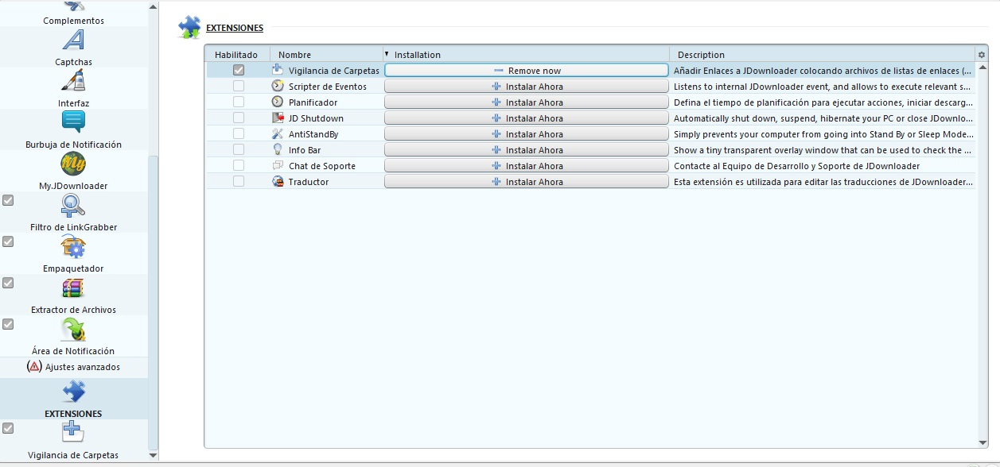
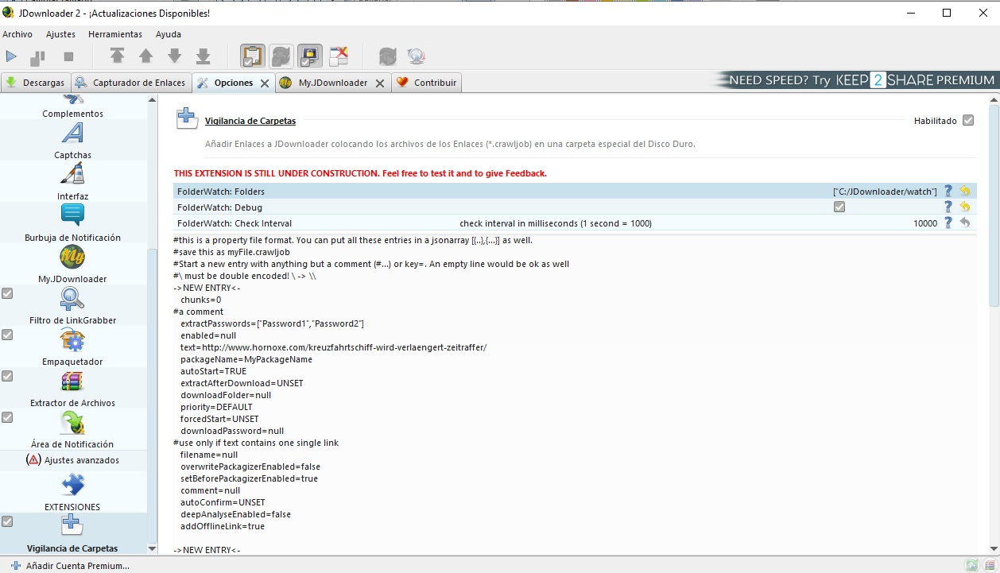
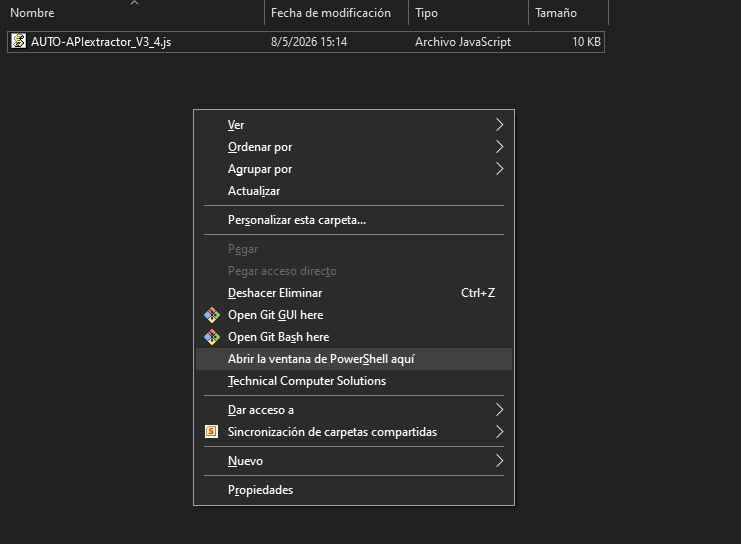
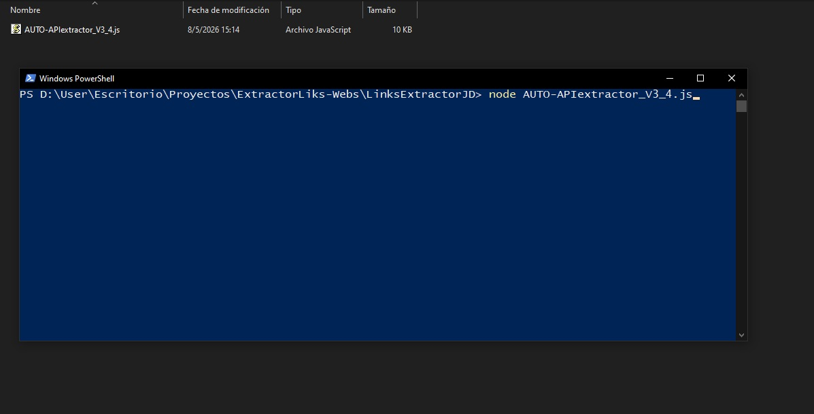
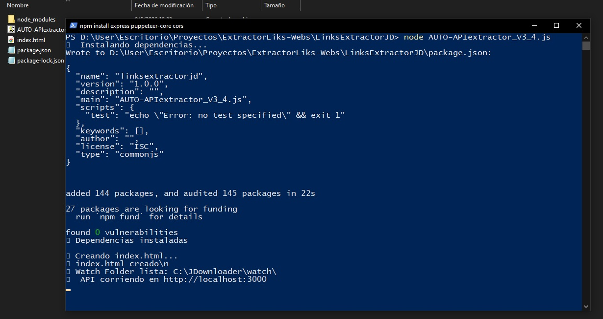
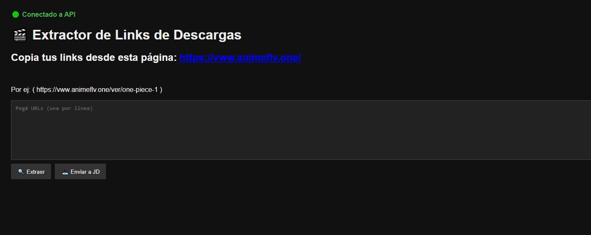
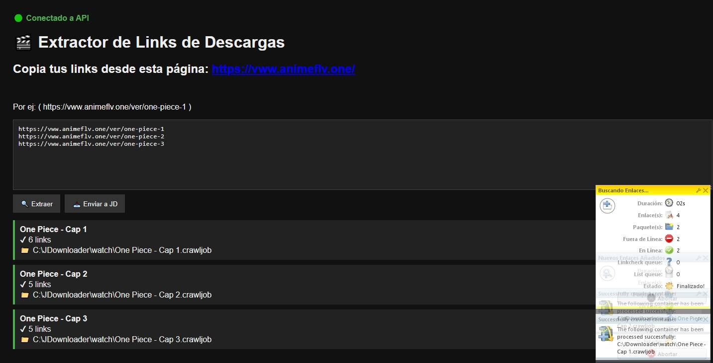
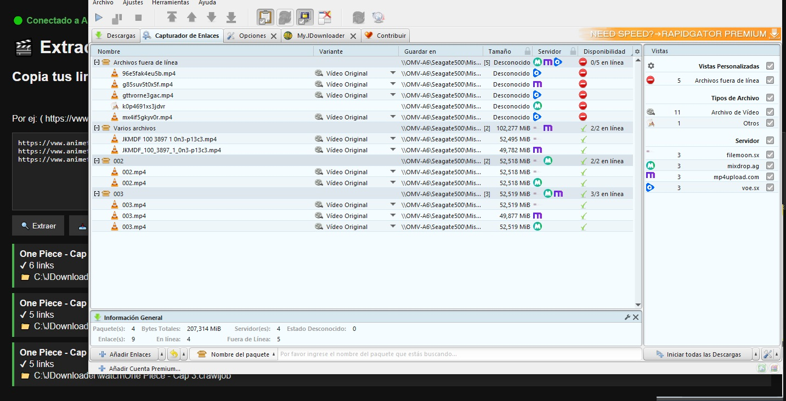

# Tutorial de uso

Guía rápida para utilizar el sistema paso a paso.

---

## 0 Instalar Node.js

Este proyecto requiere Node.js para funcionar.

Descargar desde:

https://nodejs.org/

Verificar instalación:

```bash
node -v
npm -v
```

# Paso 1 — Preparar Jdonloader 

ingresamos a extenciones de jdonloader


configuramos la ubicacion de la carpeta wachfolder



# Paso 2 
abrir la terminal Apretando Shift + Click derecho 




Iniciar el servidor:

```bash
node AUTO-APIextractor_V3_4.js
```


al darle enter ya tendriamos instalado el script 



```text
Luego abrir el archivo index.html:
```



---

# Paso 3 — Pegar URLs

Copiar y pegar las URLs de animeflv.one dentro del textarea.

Ejemplo:

```text
https://animeflv.one/ver/episodio-1
https://animeflv.one/ver/episodio-2
```



luego de manera automatica se añaden al capturador de enlaces del JDonloader


